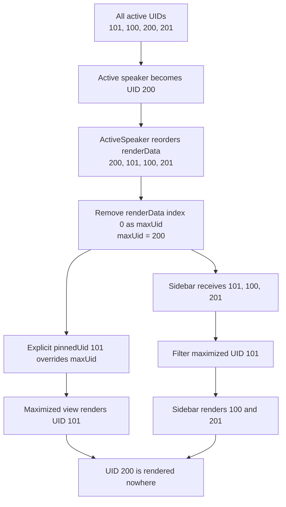
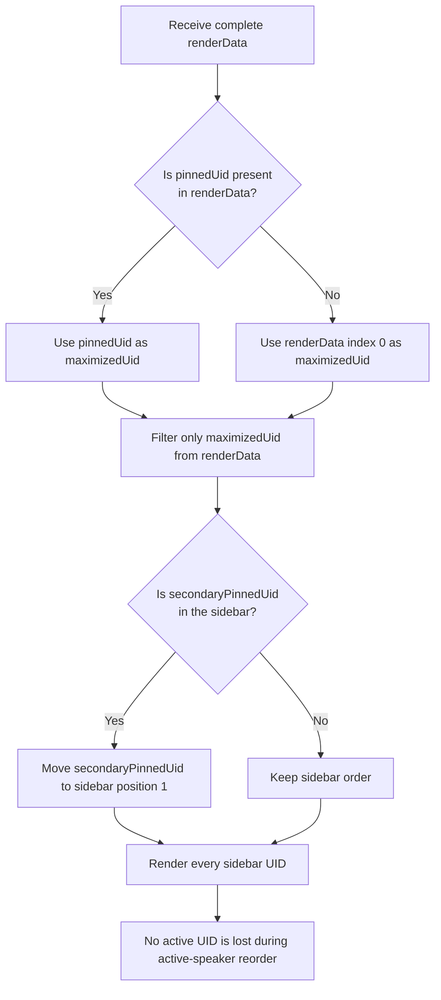
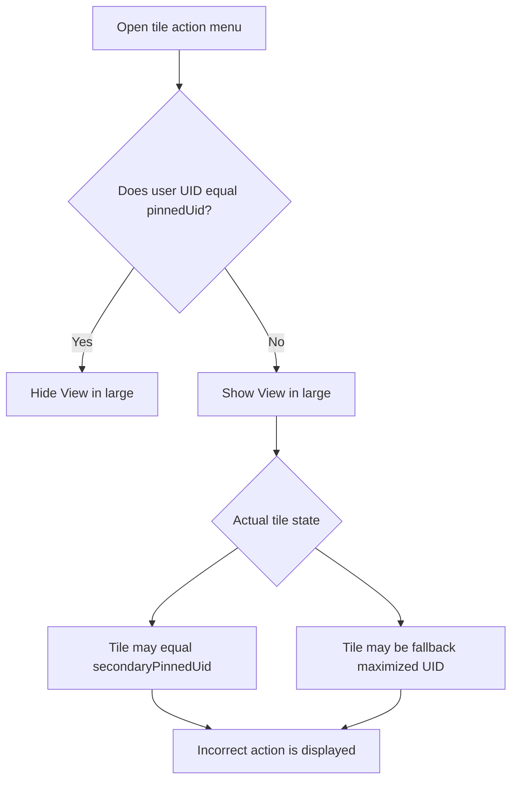
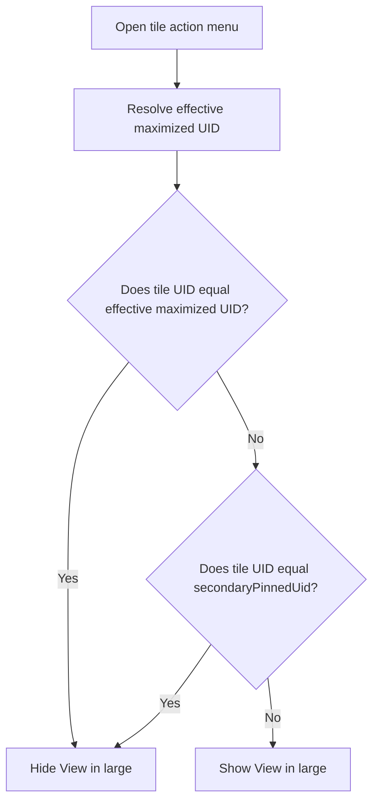

# Pinned Layout Tile Visibility and Action Menu Fixes

This document covers two related Pinned layout defects:

1. A participant tile could disappear from the sidebar after active-speaker
   reordering.
2. **View in large** could be offered for a tile that was already displayed in
   the large view or pinned to the top of the sidebar.

# Issue 1: Missing Sidebar Tile

## Issue

In Pinned layout, a participant or screen-share tile could disappear from the
left sidebar after the active speaker changed or a user selected **View in
large**. Switching to Grid layout still showed every tile, confirming that the
RTC stream and `activeUids` entry were still present.

The problem was limited to how `PinnedVideo` divided the same `renderData`
array between the maximized view and the sidebar.

## Root cause

The previous implementation destructured `renderData` immediately:

```ts
const [maxUid, ...minUids] = renderData;
```

It later rendered `pinnedUid || maxUid` in the maximized view. This assumes that
`renderData[0]` is always the maximized UID.

That assumption is invalid when `pinnedUid` is set. Active-speaker processing
can reorder `renderData` and place another participant at index `0`, while the
explicit `pinnedUid` remains unchanged.

Example:

```text
renderData = [200, 101, 100, 201]
pinnedUid = 101

Maximized tile rendered: 101
Sidebar source:          [101, 100, 201]
```

UID `200` was removed by array destructuring because it occupied index `0`, but
UID `101` was rendered as the maximized tile. UID `200` was therefore rendered
in neither location.

## Previous flow



## Fix

The updated implementation determines the effective maximized UID first and
only then derives the sidebar:

```ts
const maximizedUid =
  pinnedUid && renderData.includes(pinnedUid) ? pinnedUid : renderData[0];

const sidebarUids = renderData.filter(uid => uid !== maximizedUid);
```

If a valid `secondaryPinnedUid` exists, it is moved to the first sidebar
position without removing any other UID.

```text
renderData = [200, 101, 100, 201]
pinnedUid = 101
secondaryPinnedUid = 100

Maximized UID: 101
Sidebar UIDs:  [100, 200, 201]
```

## Updated flow



## What the fix resolves

- Active-speaker reordering no longer causes the UID at `renderData[0]` to
  disappear.
- Clicking **View in large** no longer removes an unrelated sidebar tile.
- A participant or screen-share tile remains visible when moving between the
  maximized view and sidebar.
- Pin-to-top ordering keeps the secondary pin first without discarding other
  participants.
- Stable UID-based React keys prevent a reordered position from reusing the
  wrong tile instance.
- **View in large** is hidden for the primary pin, pin-to-top tile, and fallback
  maximized tile.

## Diagnostic logging

The following log records the effective layout whenever its UID state changes:

```text
[PINNED_LAYOUT] pinned layout UIDs resolved
```

Relevant fields:

- `renderData`: complete ordered UID input.
- `pinnedUid`: explicit maximized UID, when set.
- `secondaryPinnedUid`: pin-to-top UID, when set.
- `maximizedUid`: UID selected for the large view.
- `sidebarUids`: complete ordered set of sidebar tiles.

For a valid layout, `maximizedUid` plus `sidebarUids` should contain every UID
from `renderData` exactly once.

## Verification

Regression coverage verifies that:

1. A UID moved to index `0` by active-speaker ordering remains visible.
2. The secondary pin remains first in the sidebar.
3. No other sidebar UID is removed.
4. An invalid or stale primary pin falls back to `renderData[0]`.
5. **View in large** is not offered for any tile already displayed as large or
   pinned to top.

# Issue 2: Incorrect View in Large Action

## Issue

In Pinned layout, the following sequence could display an invalid **View in
large** action:

1. Open a tile's action menu and select **Pin to top**.
2. The first and second sidebar positions are reordered.
3. Open the action menu on the tile that is already large or pinned to top.
4. The menu still offers **View in large**.

The issue affected both participant-video and screen-share tiles.

## Root cause

The action menu originally used only `pinnedUid` to determine whether a tile
was already displayed in the large view:

```ts
if (pinnedUid !== user.uid) {
  // Add View in large action
}
```

This missed two valid Pinned layout states.

### Pin-to-top tile

A tile selected with **Pin to top** is stored in `secondaryPinnedUid`, not
`pinnedUid`. Because the menu ignored `secondaryPinnedUid`, the tile could be
offered both **Remove from top** and **View in large**.

### Fallback maximized tile

Pinned layout does not always require an explicit `pinnedUid`. When
`pinnedUid` is empty, the first active UID is used as the effective maximized
tile.

The diagnostic log demonstrated this state:

```json
{
  "renderData": [293517170, 293517171, 221931672],
  "pinnedUid": null,
  "secondaryPinnedUid": 293517171,
  "maximizedUid": 293517170,
  "sidebarUids": [293517171, 221931672]
}
```

UID `293517170` was visibly maximized even though `pinnedUid` was `null`.
Checking only `pinnedUid` therefore incorrectly allowed **View in large** for
that tile.

## Previous action-menu flow



## Fix

The menu now checks all states that mean the tile is already promoted:

```ts
const effectiveMaximizedUid = pinnedUid || activeUids[0];

const canViewInLarge =
  user.uid !== effectiveMaximizedUid &&
  user.uid !== secondaryPinnedUid;
```

The implemented helper receives `activeUids[0]` as the fallback maximized UID
and prefers an explicit `pinnedUid` when one exists.

## Updated action-menu flow



## What the fix resolves

- The explicit primary pin is not offered **View in large**.
- The pin-to-top tile is not offered **View in large**.
- The fallback maximized tile is not offered **View in large** when
  `pinnedUid` is empty.
- The logic applies equally to participant-video and screen-share tiles.
- Other sidebar tiles continue to offer **View in large** normally.

## Verification

Regression tests cover all three promoted states:

1. `user.uid === pinnedUid` returns `false` for `canViewInLarge`.
2. `user.uid === secondaryPinnedUid` returns `false`.
3. `user.uid === activeUids[0]` returns `false` when `pinnedUid` is empty.
4. An unrelated sidebar UID returns `true`.
